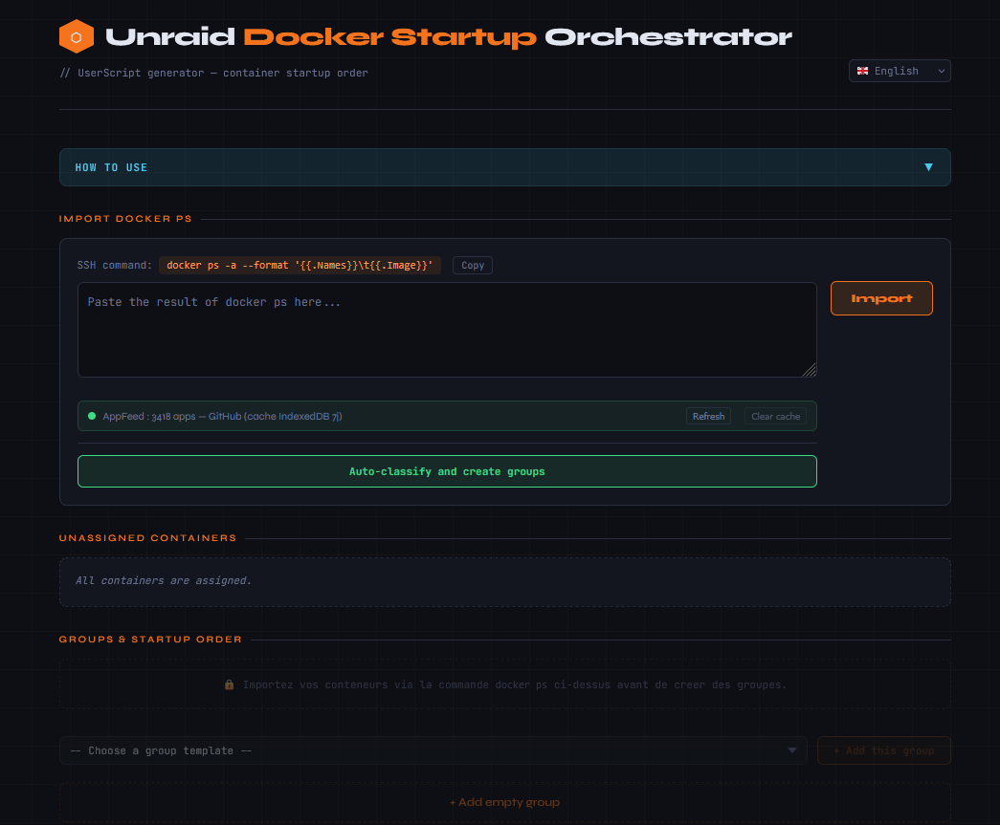

# 🐳 Unraid Docker Startup Orchestrator

🚀 Regain Control of Your Docker Startup

Unraid Docker Startup Orchestrator is a sleek web solution to replace Unraid's cluttered startup with an intelligent, logged, and highly configurable sequence.

The problem: Unraid's native autostart launches everything at once. The result? Your download apps start without a VPN, and your websites crash because the database isn't ready yet.

The solution: Orchestration based on real health checks (running status) and a logical hierarchy.

You can test the interface via GitHub Pages. Or download the index.html file for local use.
✨ Key Features

Feature & Description

🔍 wait_for --> Intelligent. Checks via the Docker API if the container is truly operational before continuing.

🛡️ Idempotence --> Automatic detection of already active containers to avoid duplicate errors.

📋 Production Logs --> Real-time tracking and history in /tmp/docker_start_order.log.

🌐 AppFeed Integration --> Fetches icons and info directly from Community Applications.

🔒 100% Private --> Local processing in your browser. No data leaves your network.
🏗️ Startup Logic

Here is how the script organizes the survival of your services after a reboot:
Extrait de code

    graph TD
        A[Unraid Array Start] --> B{Group 1: Network}
        B -->|OK| C[VPN / DNS / AdGuard]
        C --> D{Group 2: Data}
        D -->|Wait for Running| E[MariaDB / Postgres / Redis]
        E --> F{Group 3: Proxy}
        F -->|OK| G[Nginx Proxy Manager]
        G --> H[Group 4: Web Applications]
        H --> I[Group 5: Media & Downloads]
        I --> J[✅ System Operational]

🛠️ Quick Start

    Generate the script

        Go to the Web Interface.

        Import your containers, organize them via drag-and-drop.

        Click Generate script and copy the code.

# 
⚠️ Important: Disable native auto-start in the Unraid Docker tab for containers managed by this script.

📊 Monitoring & Debug

You can monitor the script's progress directly from your Unraid terminal:
Bash

# To view the startup in real-time
tail -f /tmp/docker_start_order.log

💾 Backup Structure (JSON)

The tool allows you to export your configuration. Here is what a typical configuration block looks like:
JSON

{
  "name": "Databases",
  "pause": 10,
  "containers": [
    { "id": "mariadb", "waitFor": true, "timeout": 45 }
  ]
}

🤝 Contribution & Support

Ideas are welcome! Feel free to open an Issue or a Pull Request.

🛠️ Development: HTML5, CSS3 (modern variables), Vanilla JS.

☕ Support: If this tool makes your life easier, you can buy me a [coffee on Ko-fi](https://ko-fi.com/cbh17000) !

<i>Developed with ❤️ for the Unraid community.</i>

This project was developed with AI-assisted coding.
All architecture, design decisions and validation were supervised and directed by the author.

-------------------------------------------------------------------------------------------------------------------------------------------------------------------------------------------------------------
-------------------------------------------------------------------------------------------------------------------------------------------------------------------------------------------------------------

# 🐳 Unraid Docker Startup Orchestrator

-------------------------------------------------------------------------------------------------------------------------------------------------------------------------------------------------------------

##🚀 Redonnez le contrôle à votre démarrage Docker

Unraid Docker Startup Orchestrator est une solution web élégante pour remplacer le démarrage désordonné d'Unraid par une séquence intelligente, journalisée et hautement configurable.

Le problème : L'autostart natif d'Unraid lance tout en même temps. Résultat ? Vos apps de téléchargement démarrent sans VPN, et vos sites web plantent car la base de données n'est pas encore prête.

La solution : Une orchestration basée sur des vérifications d'état réelles (running) et une hiérarchie logique.

Vous pouvez testé l'interface via [GitHub Pages](https://cbh17000.github.io/unraid-docker-startup-orchestrator/). Ou télécharger le fichier index.html pour une utilisation local.

-------------------------------------------------------------------------------------------------------------------------------------------------------------------------------------------------------------

## ✨ Points Forts

Fonctionnalité et Description

🔍 wait_for --> Intelligent,Vérifie via l'API Docker si le conteneur est réellement opérationnel avant de continuer.

🛡️ Idempotence --> Détection automatique des conteneurs déjà actifs pour éviter les erreurs de doublons.

📋 Logs de Production --> Suivi en temps réel et historique dans /tmp/docker_start_order.log.

🌐 Intégration AppFeed --> Récupère les icônes et infos directement depuis Community Applications.

🔒 100% Privé --> Traitement local dans votre navigateur. Aucune donnée ne quitte votre réseau.

-------------------------------------------------------------------------------------------------------------------------------------------------------------------------------------------------------------

## 🏗️ Logique de Démarrage

Voici comment le script organise la survie de vos services après un redémarrage :
Extrait de code

    graph TD
        A[Démarrage Array Unraid] --> B{Groupe 1: Réseau}
        B -->|OK| C[VPN / DNS / AdGuard]
        C --> D{Groupe 2: Data}
        D -->|Wait for Running| E[MariaDB / Postgres / Redis]
        E --> F{Groupe 3: Proxy}
        F -->|OK| G[Nginx Proxy Manager]
        G --> H[Groupe 4: Applications Web]
        H --> I[Groupe 5: Médias & Téléchargement]
        I --> J[✅ Système Opérationnel]

-------------------------------------------------------------------------------------------------------------------------------------------------------------------------------------------------------------

## 🛠️ Installation Rapide
1. Générer le script

    Rendez-vous sur L'interface Web.

    Importez vos conteneurs, organisez-les par glisser-déposer.

    Cliquez sur Générer le script et copiez le code.

   -------------------------------------------------------------------------------------------------------------------------------------------------------------------------------------------------------------

    # 
⚠️ Important : Désactivez l'auto-start natif dans l'onglet Docker d'Unraid pour les conteneurs gérés par ce script.

   -------------------------------------------------------------------------------------------------------------------------------------------------------------------------------------------------------------

## 📊 Monitoring & Debug

Vous pouvez surveiller le bon déroulement du script directement depuis votre terminal Unraid :
Bash

    # Pour voir le démarrage en temps réel
    tail -f /tmp/docker_start_order.log

-------------------------------------------------------------------------------------------------------------------------------------------------------------------------------------------------------------

## 💾 Structure de Sauvegarde (JSON)

L'outil vous permet d'exporter votre configuration. Voici à quoi ressemble un bloc de configuration type :
JSON

    {
      "name": "Bases de données",
      "pause": 10,
      "containers": [
        { "id": "mariadb", "waitFor": true, "timeout": 45 }
      ]
    }

-------------------------------------------------------------------------------------------------------------------------------------------------------------------------------------------------------------

## 🤝 Contribution & Support

Les idées sont les bienvenues ! N'hésitez pas à ouvrir une Issue ou une Pull Request.

    🛠️ Développement : HTML5, CSS3 (variables modernes), JS Vanilla.

☕ Soutien : Si cet outil vous simplifie la vie, vous pouvez [payer un café sur Ko-fi](https://ko-fi.com/cbh17000) !.

Ce projet a été développé avec l'assistance d'une IA pour la génération de code.
La conception, l’architecture, la supervision et les corrections ont été réalisées par l’auteur.

<i>Développé avec ❤️ pour la communauté Unraid.</i>
